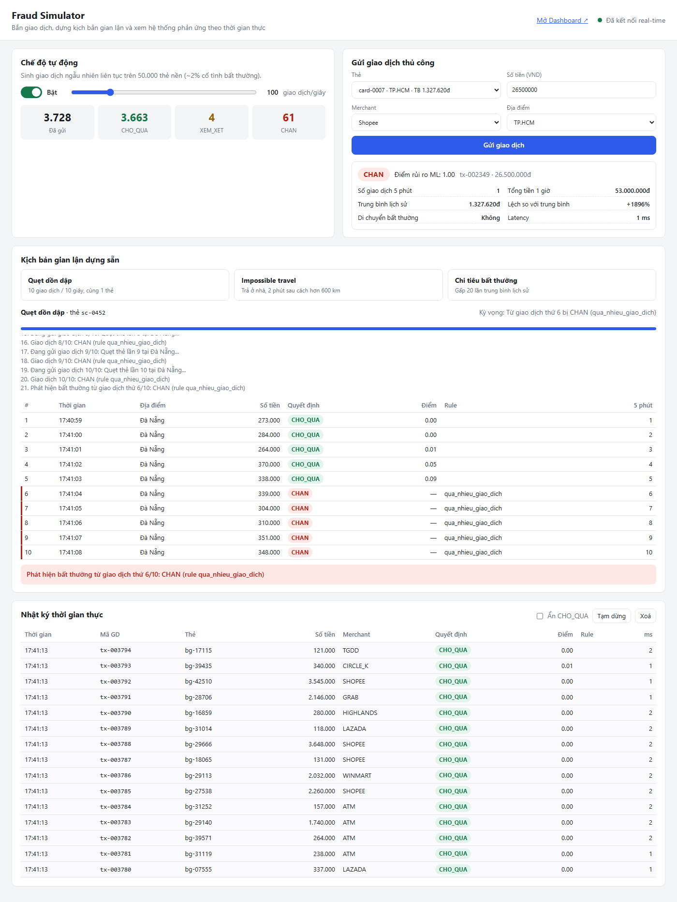
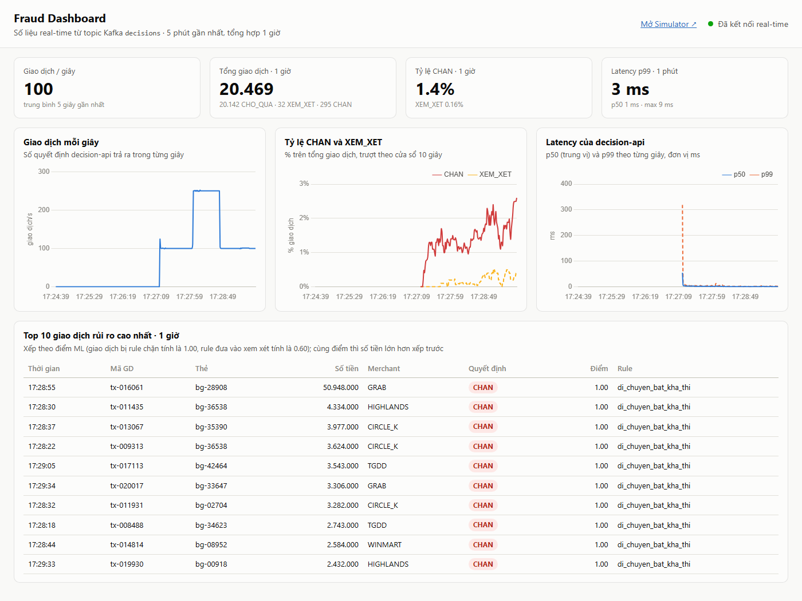
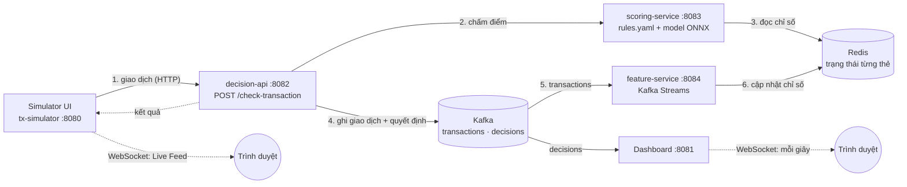

# Realtime Fraud Detection

Hệ thống phát hiện gian lận giao dịch thẻ theo thời gian thực, viết bằng Java. Với mỗi giao dịch, hệ thống trả lời **CHO_QUA / XEM_XET / CHAN** trong vài mili-giây, dựa trên 5 chỉ số tính liên tục từ luồng giao dịch, một bộ rule sửa được lúc đang chạy, và một model ML.

Java 21 · Spring Boot 3.5 · Apache Kafka 4.3 (KRaft) + Kafka Streams · Redis 8 · ONNX Runtime · Python / scikit-learn · WebSocket (STOMP) · Chart.js · Docker Compose · Gatling

Đề bài gốc: [docs/realtime-fraud-detection.md](docs/realtime-fraud-detection.md)





## Chạy nhanh

Yêu cầu: Docker Desktop. Không cần cài Java hay Maven.

```powershell
git clone https://github.com/ndchien2004/fraud-detection.git
cd fraud-detection
docker compose up -d --build --wait
```

- Lần build đầu mất khoảng 7 phút để tải thư viện. Các lần sau nhanh hơn nhiều nhờ bộ nhớ đệm.
- Từ trạng thái sạch, cả 8 container healthy sau khoảng 45 giây.

| Trang | Địa chỉ |
|---|---|
| **Simulator UI**: gửi giao dịch, chạy kịch bản gian lận, Live Feed | http://localhost:8080 |
| **Dashboard**: biểu đồ real-time | http://localhost:8081 |
| Kafka UI: xem topic và message | http://localhost:8090 |
| Decision API | `POST http://localhost:8082/check-transaction` |

Thử nhanh: mở Simulator và bấm **Impossible travel**, giao dịch thứ 2 sẽ hiện đỏ. Bật **Chế độ tự động** rồi mở Dashboard để xem số liệu chạy.

```powershell
docker compose ps              # trạng thái + health
docker compose logs -f decision-api
docker compose down            # tắt (giữ dữ liệu)
docker compose down -v         # tắt và xoá sạch dữ liệu
```

## Kiến trúc



**Hành trình của một giao dịch:**

1. Simulator (hoặc bất kỳ client nào) gọi `POST /check-transaction`.
2. decision-api hỏi scoring-service.
3. scoring-service đọc "hồ sơ" của thẻ trong Redis: các ô 10 giây của 1 giờ gần nhất, vị trí và thời điểm giao dịch cuối, trung bình 30 ngày. Nó tính **5 chỉ số** (cộng cả giao dịch hiện tại), rồi áp `rules.yaml` từ trên xuống. Nếu không rule nào khớp thì hỏi model ONNX để lấy điểm 0–1.
4. decision-api trả kết quả (khoảng 5 ms), đồng thời ghi giao dịch vào topic `transactions` và quyết định vào topic `decisions`.
5. feature-service (Kafka Streams) đọc `transactions` và cập nhật hồ sơ của thẻ trong Redis, để lần quẹt tiếp theo của thẻ đó thấy giao dịch này.
6. Dashboard đọc `decisions` và mỗi giây đẩy biểu đồ mới xuống trình duyệt qua WebSocket.

**Nguyên tắc cốt lõi: chấm điểm trước, ghi sổ sau.** Giao dịch được so với lịch sử **trước nó**, rồi mới trở thành lịch sử cho các lần sau. Nhờ vậy không đếm trùng và không có race condition giữa luồng chấm điểm và Kafka Streams.

| Service | Port | Vai trò |
|---|---|---|
| [tx-simulator](tx-simulator) | 8080 | Simulator UI, Auto Mode (1–500 tx/s), 3 kịch bản gian lận, Live Feed qua WebSocket |
| [dashboard](dashboard) | 8081 | Đọc topic `decisions`: giao dịch/giây, tỷ lệ CHAN, latency p50/p99, top 10 rủi ro |
| [decision-api](decision-api) | 8082 | API công khai, gọi scoring, đo latency, ghi Kafka; trả `XEM_XET` nếu scoring không trả lời |
| [scoring-service](scoring-service) | 8083 | Tính 5 chỉ số từ Redis, rule engine (SpEL, tự reload), model ONNX |
| [feature-service](feature-service) | 8084 | Kafka Streams: gom giao dịch theo thẻ vào các ô 10 giây, ghi Redis; nạp trung bình 30 ngày |
| [common](common) | – | DTO, công thức 5 chỉ số, định dạng dữ liệu Redis, danh sách thẻ, dùng chung cho mọi service |
| [model-training](model-training) | – | Python: khám phá dataset Kaggle, train model, xuất `model.onnx` |
| [load-test](load-test) | – | Gatling, xem [LOAD_TEST.md](LOAD_TEST.md) |

## 5 chỉ số

Công thức nằm ở một chỗ duy nhất: [FeatureCalculator.java](common/src/main/java/com/frauddetection/common/FeatureCalculator.java).

| Chỉ số | Cách tính |
|---|---|
| `so_giao_dich_5_phut` | số giao dịch của thẻ trong 5 phút gần nhất (kể cả giao dịch hiện tại) |
| `tong_tien_1_gio` | tổng tiền của thẻ trong 1 giờ gần nhất (kể cả giao dịch hiện tại) |
| `trung_binh_lich_su` | trung bình 30 ngày, tính "offline" (mô phỏng job chạy đêm) và nạp sẵn vào Redis lúc khởi động |
| `lech_so_voi_trung_binh` | `(amount − trung bình) / trung bình`, ví dụ gấp 20 lần → `19.0` |
| `khoang_cach_bat_thuong` | khoảng cách Haversine tới giao dịch trước / thời gian giữa 2 giao dịch > **900 km/h**, chỉ xét khi cách nhau ≥ 50 km |

## Rules và model ML

[config/rules.yaml](config/rules.yaml), đúng như ví dụ trong đề:

```yaml
rules:
  - name: "qua_nhieu_giao_dich"        # quẹt dồn dập
    condition: "so_giao_dich_5_phut > 5"
    action: "CHAN"
  - name: "di_chuyen_bat_kha_thi"      # impossible travel
    condition: "khoang_cach_bat_thuong == true"
    action: "CHAN"
  - name: "chi_tieu_qua_cao_tuyet_doi"
    condition: "amount > 50000000"
    action: "XEM_XET"
ml_thresholds:
  chan_neu_diem_tren: 0.8
  xem_xet_neu_diem_tren: 0.4
```

- **Sửa không cần build lại:** lưu file là scoring-service tự đọc lại trong vòng 5 giây, kể cả khi chạy trong Docker (thư mục `config/` được mount vào container). Sửa sai (lỗi YAML, sai tên biến) thì **rules cũ vẫn chạy**, và lỗi được ghi vào log.
- **An toàn:** điều kiện chạy bằng Spring Expression Language trong `SimpleEvaluationContext`, chỉ đọc được biến, không gọi được code Java.
- **Model ML:** Gradient Boosting train bằng scikit-learn, chạy trong Java qua ONNX Runtime (dưới 1 ms mỗi lần). Dataset Kaggle chỉ có các cột ẩn danh `V1..V28`, không khớp với 5 chỉ số của hệ thống. Vì vậy model được train trên dữ liệu sinh theo 5 chỉ số, lấy tỷ lệ và phân phối số tiền từ Kaggle. Chi tiết và giới hạn: [model-training/README.md](model-training/README.md), [metrics.md](model-training/metrics.md).

## API

`POST /check-transaction` (decision-api :8082), đúng theo API contract của đề:

```json
{
  "transactionId": "tx-000123",
  "cardId": "card-0007",
  "amount": 25000000,
  "merchant": "ATM",
  "location": { "lat": 21.0285, "lon": 105.8542 },
  "timestamp": "2026-08-19T10:15:32Z"
}
```

```json
{
  "transactionId": "tx-000123",
  "decision": "CHAN",
  "riskScore": 0.99,
  "triggeredRule": null,
  "features": {
    "so_giao_dich_5_phut": 1,
    "tong_tien_1_gio": 25000000,
    "trung_binh_lich_su": 1327620.0,
    "lech_so_voi_trung_binh": 17.83,
    "khoang_cach_bat_thuong": false
  },
  "latencyMs": 5
}
```

`timestamp` có thể bỏ trống, khi đó mặc định là thời điểm hiện tại. Nếu một rule khớp, `triggeredRule` là tên rule đó và `riskScore = null`.

Các endpoint khác (PowerShell):

```powershell
# Simulator
Invoke-RestMethod -Method Post -Uri http://localhost:8080/simulator/manual-transaction -ContentType "application/json" -Body '{"cardId":"card-0007","amount":25000000,"merchant":"ATM","city":"HA_NOI"}'
Invoke-RestMethod -Method Post -Uri "http://localhost:8080/simulator/scenario/rapid-fire?wait=true"          # hoặc impossible-travel, unusual-amount
Invoke-RestMethod -Method Post -Uri http://localhost:8080/simulator/auto-mode -ContentType "application/json" -Body '{"enabled":true,"ratePerSecond":50}'
Invoke-RestMethod http://localhost:8080/simulator/stats

# Chỉ số của một thẻ, và xem trước chỉ số của một giao dịch giả định
Invoke-RestMethod http://localhost:8084/features/card-0007
Invoke-RestMethod -Method Post -Uri http://localhost:8084/features/preview -ContentType "application/json" -Body '{"cardId":"card-0007","amount":26000000,"city":"HO_CHI_MINH"}'

# Rules đang có hiệu lực, reload ngay
Invoke-RestMethod http://localhost:8083/admin/rules
Invoke-RestMethod -Method Post -Uri http://localhost:8083/admin/reload-rules

# Số liệu dashboard
Invoke-RestMethod http://localhost:8081/api/metrics
```

Trong Git Bash, Linux hoặc macOS, dùng `curl` như thường. Trong Windows PowerShell 5.1, `curl` là tên gọi tắt của `Invoke-WebRequest` và không hiểu `-X/-H/-d`.

## Simulator UI và Dashboard

| Simulator (:8080) | |
|---|---|
| Chế độ tự động | 1–500 giao dịch/giây trên **50.000 thẻ nền** (`bg-*`), khoảng 2% cố tình bất thường (số tiền gấp 10–30 lần, hoặc thanh toán ở nước ngoài) |
| Gửi thủ công | 20 thẻ demo `card-0001`…`card-0020`. Chọn thẻ, số tiền, merchant, thành phố; hiện quyết định, điểm, rule, 5 chỉ số, latency |
| Quẹt dồn dập | 10 giao dịch trong 10 giây trên cùng 1 thẻ, **từ giao dịch 6 bị CHAN** |
| Impossible travel | thanh toán ở thành phố nhà, 2 phút sau ở thành phố cách hơn 600 km, **giao dịch 2 bị CHAN** |
| Chi tiêu bất thường | gấp 20 lần trung bình lịch sử, bị **XEM_XET hoặc CHAN** tùy điểm ML |
| Nhật ký thời gian thực | 100 giao dịch mới nhất qua WebSocket, tô màu theo quyết định; có nút tạm dừng và lọc bỏ CHO_QUA |

| Dashboard (:8081) | |
|---|---|
| 4 ô số liệu | giao dịch/giây, tổng giao dịch 1 giờ, tỷ lệ CHAN 1 giờ, latency p99 1 phút |
| Biểu đồ (5 phút) | giao dịch mỗi giây · tỷ lệ CHAN/XEM_XET (trượt 10 giây) · latency p50/p99 |
| Top 10 | giao dịch rủi ro cao nhất trong 1 giờ |

Dashboard giữ số liệu trong RAM với kích thước cố định (3.600 ô 1 giây + 60 ô 1 phút), và mỗi lần khởi động **tua Kafka về 1 giờ trước** (`seekToTimestamp`) để dựng lại biểu đồ.

## Quyết định thiết kế và đánh đổi

| Quyết định | Lý do | Đánh đổi |
|---|---|---|
| **decision-api ghi Kafka sau khi chấm điểm** (đề ghi là simulator đẩy Kafka song song) | Client nào gọi API (UI, curl, Gatling) thì giao dịch cũng được ghi nhận; không đếm trùng, không race condition | Chỉ số được cập nhật trễ khoảng 100–200 ms sau khi trả lời. Hai lần quẹt cách nhau vài mili-giây có thể chưa thấy nhau |
| **Redis lưu các ô 10 giây**, không lưu từng giao dịch | Tối đa 360 ô mỗi thẻ dù tải 500 tx/s, đọc/ghi nhanh | Sai số tối đa 10 giây ở mép cửa sổ |
| Chỉ số tính lúc chấm điểm (**trạng thái trước + giao dịch hiện tại**) bằng một công thức dùng chung | Chính xác tới từng giao dịch, feature-service và scoring không bao giờ tính lệch nhau | scoring phải đọc Redis 2 lần mỗi request |
| **Rules trước, model sau** | Rule chắc chắn, rẻ, dễ giải thích với khách hàng; model xử lý vùng xám | Rule cứng có thể quá tay, ví dụ 6 lần quẹt thật trong 5 phút vẫn bị chặn |
| **Scoring sập thì trả XEM_XET** | Không cho gian lận lọt qua (CHO_QUA), cũng không chặn toàn bộ khách (CHAN) | Tăng việc cho bộ phận xem xét thủ công |
| **Model train trên dữ liệu sinh theo 5 chỉ số**, lấy tỷ lệ từ Kaggle | Kaggle chỉ có cột ẩn danh `V1..V28`, không khớp với dữ liệu lúc chạy thật | Model phần lớn học lại các giả định; ngân hàng thật sẽ train trên lịch sử có nhãn |
| **ONNX** thay vì gọi một service Python | Model chạy ngay trong JVM, dưới 1 ms, không thêm vòng mạng và không thêm thứ có thể sập | Mỗi lần train lại phải khởi động lại scoring-service |
| Auto Mode dùng **50.000 thẻ nền** (đề ghi 20 thẻ) | Với 20 thẻ, rule "> 5 giao dịch / 5 phút" chặn gần như mọi giao dịch khi vượt khoảng 0,3 tx/s | Thẻ nền không hiện trong dropdown |
| Kịch bản dùng **500 thẻ riêng** (`sc-*`), chọn thẻ không có giao dịch trong 2 giờ qua | Mỗi kịch bản để lại dấu vết 1 giờ (10 giao dịch, một chuyến "bay"...), chạy lại trên cùng thẻ sẽ sai | Simulator phải hỏi feature-service trước mỗi lần chạy |
| Live Feed gửi **theo lô mỗi 250 ms** | 500 tx/s không thành 500 tin nhắn WebSocket mỗi giây | Trễ tối đa 250 ms trên màn hình |
| Health check thật: feature-service chỉ `UP` khi Kafka Streams `RUNNING` | Docker không gửi traffic tới service chưa sẵn sàng | Khởi động chậm hơn vài giây |

## Hiệu năng

Laptop i7-12700H, mọi thứ (kể cả Gatling) chạy chung một máy:

| Tải | Lỗi | p50 | p99 |
|---|---|---|---|
| 250 – 1.000 req/s | 0% | 4–5 ms | 8–15 ms |
| 1.500 – 2.000 req/s | 0% | 6 ms | 50–81 ms |
| 2.500 req/s (điểm gãy) | 0% | 8 ms | 387 ms |
| 3.000 req/s (quá tải) | 55% (lỗi kết nối) | 3,9 s | 24,5 s |

Nút thắt là CPU của decision-api. Kafka đo riêng đạt 67.800 msg/s, không phải nút thắt. Sau mọi mức tải, feature-service và dashboard không tồn đọng message nào.

Chi tiết, phân tích nút thắt và hướng cải thiện: [LOAD_TEST.md](LOAD_TEST.md).

## Phát triển

Yêu cầu: JDK 21+. Maven không cần cài, dự án dùng Maven Wrapper.

```powershell
docker compose up -d kafka redis kafka-ui       # chỉ hạ tầng
.\mvnw.cmd verify                               # build + toàn bộ test
.\mvnw.cmd install -DskipTests                  # rồi chạy từng service, mỗi service một terminal:
.\mvnw.cmd -pl feature-service spring-boot:run
.\mvnw.cmd -pl scoring-service spring-boot:run
.\mvnw.cmd -pl decision-api spring-boot:run
.\mvnw.cmd -pl tx-simulator spring-boot:run
.\mvnw.cmd -pl dashboard spring-boot:run
```

- Nếu các container service đang chạy, tắt chúng trước (`docker compose stop tx-simulator dashboard decision-api scoring-service feature-service`) để tránh trùng cổng.
- Redis trên máy host là cổng **6380** (6379 hay bị Redis của dự án khác chiếm).
- Kafka: `localhost:9092` từ máy host, `kafka:29092` giữa các container.

```
fraud-detection/
├── common/            DTO, FeatureCalculator, CardState, CardProfiles, định dạng Redis
├── tx-simulator/      Simulator UI (static/), Auto Mode, kịch bản, WebSocket
├── feature-service/   Kafka Streams topology, HistorySeeder, health indicator
├── scoring-service/   RuleEngine, OnnxRiskModel, WeightedScoreModel (dự phòng)
├── decision-api/      POST /check-transaction, ghi Kafka
├── dashboard/         MetricsAggregator, trang Chart.js
├── model-training/    explore_kaggle.py, train.py, model.onnx, metrics.md
├── load-test/         Gatling simulation, run-steps.ps1
├── config/rules.yaml
├── Dockerfile         một Dockerfile nhiều giai đoạn cho 5 service
└── docker-compose.yml
```

## Checklist của đề (mục 9)

Kiểm tra lần cuối ngày 25/09/2026, trên hệ thống chạy bằng `docker compose` từ dữ liệu sạch.

- [x] `docker compose up` chạy toàn bộ 6 service, mở được Simulator UI tại `:8080` và Dashboard tại `:8081`. Cả 8 container healthy sau khoảng 45 giây.
- [x] Trên Simulator UI, gửi giao dịch thủ công và thấy kết quả quyết định hiện ra ngay, không cần refresh trang (ảnh chụp ở đầu README: 26,5 triệu → CHAN, điểm 0.99, latency 1 ms).
- [x] Bấm cả 3 nút kịch bản và quan sát đúng hành vi kỳ vọng:
  - quẹt dồn dập bị **CHAN từ giao dịch thứ 6** (`qua_nhieu_giao_dich`);
  - impossible travel bị **CHAN ngay giao dịch thứ 2** (`di_chuyen_bat_kha_thi`);
  - chi tiêu bất thường bị **CHAN** (điểm ML 0.98).
- [x] Bật Auto Mode, Dashboard cập nhật số liệu real-time đúng (qua WebSocket, mỗi giây).
- [x] Sửa `config/rules.yaml` (ngưỡng `so_giao_dich_5_phut` từ 5 xuống 3) thì trong khoảng 5 giây quẹt dồn dập đã bị **CHAN từ giao dịch thứ 4**, không cần build lại hay restart.
- [x] Có [LOAD_TEST.md](LOAD_TEST.md) ghi rõ throughput và latency p99 đo được.
- [x] README có ảnh chụp màn hình Simulator UI và Dashboard, có giải thích kiến trúc.

**Những điểm khác với đề** (lý do ở bảng "Quyết định thiết kế" phía trên):

- decision-api ghi giao dịch vào Kafka thay vì simulator.
- Auto Mode dùng 50.000 thẻ nền.
- Kịch bản dùng 500 thẻ riêng.
- Impossible travel đi từ thành phố nhà của thẻ tới một thành phố cách hơn 600 km (ví dụ Hà Nội → TP.HCM), thay vì luôn là Hà Nội → TP.HCM.
- `POST /simulator/scenario/{name}` hỗ trợ thêm `?wait=true` để nhận báo cáo đầy đủ.
